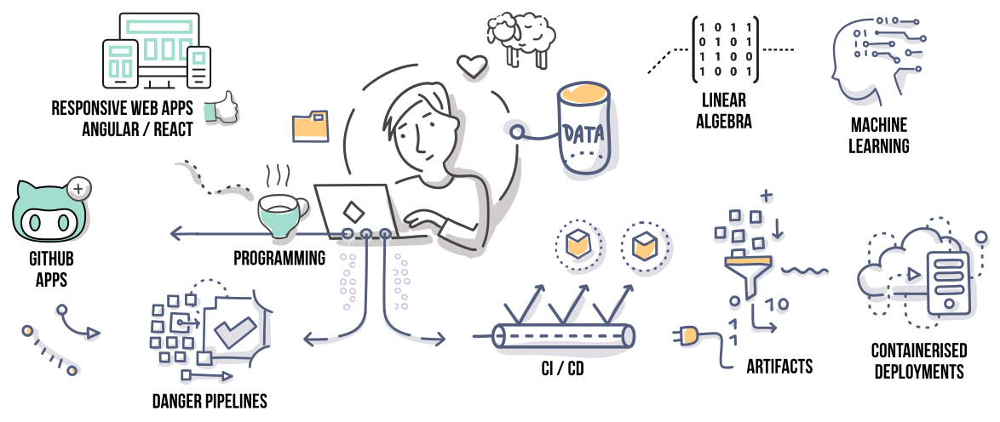

<h4 align="right">email&nbsp;:&nbsp;<a href="mailto:bentomkins@gmail.com">Benjamin Tomkins</a>&nbsp;&nbsp;&nbsp;London | W1</h4>
  

<h4 align="center">" I build cool stuff "</h4>

[About](#About)&nbsp;&nbsp;|&nbsp;&nbsp;[Service-Oriented Architecture](#SOA)&nbsp;&nbsp;|&nbsp;&nbsp;[Application Development](#APPS)&nbsp;&nbsp;|&nbsp;&nbsp;[UX/UI Design](#FAQ)&nbsp;&nbsp;|&nbsp;&nbsp;[FAQ](#FAQ)&nbsp;&nbsp;|&nbsp;&nbsp;[Random](#Random)
  
#### About :

Senior full stack GitOps designer/developer, with a background in both software/hardware development, and covering: making, inventing, designing, and prototyping cool stuff you can touch, click, and depend on; using tools like:

Half-baked full stack designer/developer, and recent Makers Academy graduate — moving into software, from a career in: making, inventing, designing, and prototyping cool stuff you can touch; using tools like <a href="https://uk.mathworks.com/products/matlab.html">`matlab`</a>, <a href="https://uk.mathworks.com/products/simulink.html">`simulink`</a>, and <a href="https://www.solidworks.com/category/3d-cad">`solidworks`</a>. And writing machine learning patents like <a href="https://patentimages.storage.googleapis.com/5a/83/c8/eb2fdf603fb63d/US20070288410A1.pdf">`this`</a>, and <a href="https://patentimages.storage.googleapis.com/41/67/07/4e40fcfb69e406/US7340060.pdf">`this`</a> ( its trendy now 🤷). And sometimes you'll find me up a ladder <a href="https://github.com/Benjamin-Tomkins/CV/blob/master/images/plastering_1.jpg">`remodelling properties`</a>, and turning things like <a href="https://github.com/Benjamin-Tomkins/CV/blob/master/images/building_1.jpg">`this`</a>, into <a href="https://github.com/Benjamin-Tomkins/CV/blob/master/images/building_2.jpg">`this`</a>.

#### Service-Oriented Architecture ( design / prototyping ):

+ `Self-aligning wound healing plasters` __ efficiently reducing caesarean section scars without surgery **[in-dev]
+ `Proof of concept for a tiered compiler` __ representing software in matrix form, to be algebraically simplified before optimising with a language compiler.
+ `Integrated database numerical engine` __ enabling computation on medical data without violating patient confidentiality.
+ `Ai Cancer detection system` __ analysing voxel-based data for CT scanners to determine likelihood and specialist recommendation engine.
+ `Ai system for SLR lenses` __ predictive algorithm to boost the quality of glass lenses to be closer to that of gemstone lenses.
+ `Representing numbers in cool new ways` __ buy me a drink and I'll draw you a picture.
+ `Cool plant/aeroponics stuff` __ buy me a drink and I'll still not tell you #NDA

#### Application Development :
+ Completed Udemy courses on: Docker, DevOps (CI/CD), XPath locators for Selenium, Automation Testing Selenium & Nightwatch, Git Command-Line Mastery, jQuery, and becoming a Certified SolidWorks Associate (CSWA).
+ <a href="https://reactjs.academy/">ReactJS Academy</a> intensive week bootcamp: ReactJS, Redux, TDD, GraphQL, Styled-Components, SSR
+ <a href="https://makers.tech/">Makers Graduate</a>: JS/ES6, Ruby, TDD, Java, Node, ReactJS, and SpringBoot for the last 3 months
+ Done some Matlab, Python (sooo rusty), Adobe products, Visual Paradigm, all things JetBrains, Solidworks, MapleSoft (google it), and the usual bits.
+ Went to school and studied <a href="https://github.com/Benjamin-Tomkins/CV/blob/master/images/degree.jpg">BSc Design Futures</a> at Westminster University.
+ Am Solidworks <a href="https://github.com/Benjamin-Tomkins/CV/blob/master/images/solidworks.png">Certified</a>.
+ Took the Stanford Professional <a href="https://github.com/Benjamin-Tomkins/CV/blob/master/images/stanford.jpg">High Performance Websites</a> course __ taught by <a href="https://stevesouders.com/about.php">Steve Souders</a>.
+ Aced <a href="https://github.com/Benjamin-Tomkins/CV/blob/master/images/big_data.png">MIT’s Big Data</a> course.
+ Did one of those online courses from Brown University, in <a href="https://github.com/Benjamin-Tomkins/CV/blob/master/images/linear_algebra.png">Applied Linear Algebra in Python</a>.
+ And, am also experienced in prototyping, manufacturing (virtual and physical), and 3D printing (stereolithography).

#### FAQ :
Are you on social media?
> no, it's creepy

What's the deal with the sheep?
> I grew up around farms and love animals with short legs, e.g: sheep, munchkin cats, shetland ponies, and bernese mountain dogs

#### Random :
+ Central St Martins thinks i'm not bad at <a href="https://github.com/Benjamin-Tomkins/CV/blob/master/images/sewing.jpg">Industrial Sewing</a>
+ Something called <a href="https://www.google.co.uk/search?q=rammed+earth+wall&source=lnms&tbm=isch&sa=X&ved=0ahUKEwifp7CPmt3cAhWpBcAKHQr8DlYQ_AUICigB&biw=1280&bih=703">Rammed Earth Structures</a> (its a thing).
+ Making women's shoes <a href="https://github.com/Benjamin-Tomkins/CV/blob/master/images/shoes_1.jpg">[1]</a>, <a href="https://github.com/Benjamin-Tomkins/CV/blob/master/images/shoes_2.jpg">[2]</a>, <a href="https://github.com/Benjamin-Tomkins/CV/blob/master/images/shoes_3.jpg">[3]</a>
+ Ice skating, but not done it in a while.
+ You know, drawing and stuff.
